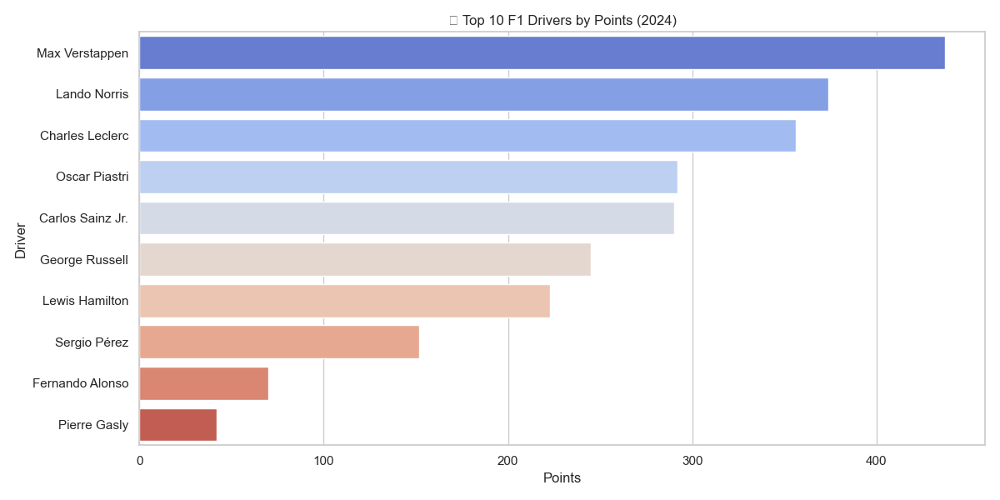

# CodeAlpha-DataVisualization: Top 10 F1 Drivers by Points (2024)

This project visualizes the top 10 Formula 1 drivers based on their 2024 points standings using Python, pandas, matplotlib, and seaborn.



# Project Structure

```
CodeAlpha-DataVisualization/
├── cleaned_f1_driver_standings_2024.csv
├── top_10_drivers_points_2024.png
└── visualize_f1_top10.py
```

- **`cleaned_f1_driver_standings_2024.csv`**: CSV file containing F1 driver names and their respective point totals for the 2024 season.
- **`visualize_f1_top10.py`**: Python script that reads the CSV and creates a horizontal bar chart of the top 10 drivers.
- **`top_10_drivers_points_2024.png`**: Output image showing the visualization.

# Description

The script performs the following steps:

1. Loads the 2024 driver standings from a local CSV file.
2. Sorts the drivers by points and selects the top 10.
3. Plots a horizontal bar chart with Seaborn.
4. Saves the visualization as a PNG image in the same directory.
